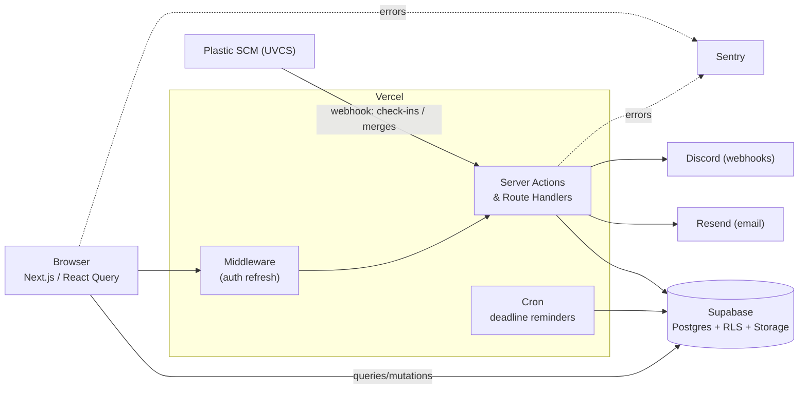

# Beaverworld Project Management

**An internal issue tracker & Kanban tool for a student game-dev team — integrated with Plastic SCM, Discord, and email.**

[](https://github.com/Tanhab/beaverworld-project-management/actions/workflows/ci.yml)


[](https://www.beaverworld.dev/)

<!-- Hero screenshot (light + dark). Add docs/media/hero.png, then uncomment:

-->

---

## What it is

Beaverworld is a student game-dev project — a mixed team of ~15–20 developers, art students, and a
supervising teacher. Our tooling was scattered: **Discord** for chat, **Milanote** for storyboarding,
and **Plastic SCM (UVCS)** for version control — with no project-management tool tying it together. We
tried **Asana**, which worked well, but its free tier caps at 10 people and premium wasn't justifiable
for an educational project.

The bigger pain was issue tracking. Our artists don't use UVCS, and unlike GitHub it has no web UI for
filing or managing issues — so whenever someone playtested the game, bugs got dropped into Discord,
where they were impossible to organize or follow up on.

I built **Beaverworld Project Management** to fix that: one place for the whole team — coders and
artists alike — to file, assign, and track issues and plan work on Kanban boards, with notifications
pushed to both **email** and **Discord** so nothing slips through. It's deployed on Vercel and used by
the team day-to-day.

---

## 🎬 Demo

🔗 **Live app:** [beaverworld.dev](https://www.beaverworld.dev/) — this is a private internal tool, so
the link lands on the login page (no public sign-up), but it confirms the app is live and deployed. A
guided walkthrough or a seeded read-only demo is available on request.

https://github.com/user-attachments/assets/a13f9d03-97ef-4dc5-80de-cffb25996304

## ✨ Key Features

Each feature leads with what it does for the user; the tech is in parentheses.

- **Issue tracking** — file, assign, prioritize, and resolve bugs with statuses, categories, and image
  attachments *(compressed client-side before upload)*.
  <!-- GIF: create an issue → toast → it appears on the board — docs/media/create-issue.gif -->
- **Kanban boards** — drag tasks across columns to plan and track work *(dnd-kit)*.
  <!-- GIF: drag-and-drop across columns — docs/media/kanban-dnd.gif -->
- **Rich-text comments & activity feed** — threaded discussion and a full audit trail per issue *(TipTap)*.
  <!-- GIF: add a comment → activity feed updates — docs/media/activity.gif -->
- **Multi-channel notifications** — in-app bell, **Discord** mentions, and **email** *(Resend)*, so
  nothing gets missed.
  <!-- GIF: notification bell filling in — docs/media/notifications.gif -->
- **Deadline reminders** — a daily **cron** nudges owners about approaching due dates *(Vercel Cron)*.
- **Plastic SCM (UVCS) integration** — an inbound webhook records check-ins and merges, giving the team
  a web view of version history they otherwise wouldn't have.
- **Role-based access** — admin / PM roles gate privileged actions.
- **Dark mode** and a responsive, accessible UI *(Radix UI + Tailwind v4)*.

---

## 🧱 Tech Stack

| Concern | Choices |
| --- | --- |
| **Framework** | Next.js 16 (App Router), React 19, TypeScript |
| **State / data** | TanStack Query (server-state), React Hook Form + Zod |
| **Backend & DB** | Supabase (Postgres, Row Level Security, Storage) |
| **Auth** | Supabase Auth (SSR cookies via middleware) |
| **UI** | Tailwind CSS v4, Radix UI, TipTap (rich text), dnd-kit (drag-drop) |
| **Notifications** | Resend + React Email, Discord webhooks, in-app |
| **Ops & tooling** | Vercel (hosting + cron), Sentry (error monitoring), generated DB types |

---

## 🏗️ Architecture



**Key decisions:**

- **Client-side data access secured by Postgres Row Level Security.** Most reads/writes go through the
  browser Supabase client; RLS is the authorization boundary.
- **Generated DB types** keep the app in sync with the schema (`pnpm db:types`).
- **TanStack Query** owns server-state (caching, retries, optimistic UX).

---

## 🚀 Getting Started

**Prerequisites:** Node.js 20+, [pnpm](https://pnpm.io/), a Supabase project.

```bash
# 1. Install dependencies
pnpm install

# 2. Configure environment
cp .env.example .env.local   # then fill in the values

# 3. Run the dev server
pnpm dev
```

Open [http://localhost:3000](http://localhost:3000).

See [`.env.example`](.env.example) for every required environment variable and what it's for.

---

## 📄 License

[MIT](LICENSE) © 2025 Tanhab Sarker

## 👤 Author

**Tanhab Sarker** — [GitHub @Tanhab](https://github.com/Tanhab)
